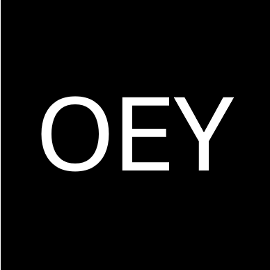

<!-- Improved compatibility of back to top link: See: https://github.com/othneildrew/Best-README-Template/pull/73 -->

<a name="readme-top"></a>

<!--
*** Thanks for checking out the Best-README-Template. If you have a suggestion
*** that would make this better, please fork the repo and create a pull request
*** or simply open an issue with the tag "enhancement".
*** Don't forget to give the project a star!
*** Thanks again! Now go create something AMAZING! :D
-->

<!-- PROJECT SHIELDS -->
<!--
*** I'm using markdown "reference style" links for readability.
*** Reference links are enclosed in brackets [ ] instead of parentheses ( ).
*** See the bottom of this document for the declaration of the reference variables
*** for contributors-url, forks-url, etc. This is an optional, concise syntax you may use.
*** https://www.markdownguide.org/basic-syntax/#reference-style-links
-->

<!-- PROJECT LOGO -->
<br />
<div align="center">
  <a href="https://github.com/olivia-oey/photography">
    
  </a>

  <h3 align="center">Portfolio</h3>

  <p align="center">
    A Website created using Tailwind CSS, HTML, CSS <br /> and JavaScript that can be used as a Personal (Photography) Portfolio.
    <br />
    <br />
    <a href="https://olivia-oey.github.io/photography/index.html">View Demo</a>
    <br />
    <br />
    
  </p>
</div>

<!-- TABLE OF CONTENTS -->
<details>
  <summary>Table of Contents</summary>
  <ol>
    <li><a href="#about-the-project">About The Project</a></li>
    <li>
      <a href="#built-with">Built With</a>
      <ul>
        <li><a href="#html-badge">HTML</a></li>
        <li><a href="#css-badge">CSS</a></li>
        <li><a href="#js-badge">JavaScript</a></li>
        <li><a href="#tailwind-badge">Tailwind CSS</a></li>
      </ul>
    </li>
    <li><a href="#quick-start">Quick Start</a></li>
    <li><a href="#getting-started">Getting Started</a>
      <ul>
        <li><a href="#installation">Installation</a></li>
      </ul>
    </li>
    <li><a href="#license">License</a></li>
    <li><a href="#contact">Contact</a></li>
    <li><a href="#acknowledgments">Acknowledgments</a></li>
  </ol>
</details>

<!-- ABOUT THE PROJECT -->

# 📋 About The Project <a name="about-the-project"></a>

[![Product Name Screen Shot][product-screenshot]](https://github.com/olivia-oey/photography/)

This project is a web-based portfolio that beautifully showcases photography work and the user. The portfolio was skillfully built using a combination of powerful front-end technologies, including Tailwind CSS, CSS, HTML, and JavaScript.

<p align="right">(<a href="#readme-top">back to top</a>)</p>

## 🛠️ Built With <a name="built-with"></a>

- [![HTML][html-badge]][html-url]
- [![CSS][css-badge]][css-url]
- [![JavaScript][js-badge]][js-url]
- [![Tailwind][tailwind-badge]][tailwind-url]

<p align="right">(<a href="#readme-top">back to top</a>)</p>

### 🏗️ Installation <a name="installation"></a>

1. Clone the repo

```sh
 git clone https://github.com/JoaoFranco03/photography-portfolio/.git
```

2.  Run the following command:

```sh
 npx tailwindcss -i ./src/input.css -o ./dist/output.css --watch
```
3.  Run the Project in a Server

4.  Change it with your own photos, about me and contact info.

5.  Publish it using your preferred hosting platform.

<p align="right">(<a href="#readme-top">back to top</a>)</p>

<!-- CONTACT -->

## 📧 Contact <a name="contact"></a>

João Franco - [https://www.linkedin.com/in/oliviaoey/]

Project Link: [https://github.com/olivia-oey/photography/](https://olivia-oey.github.io/photography/index.html)

<p align="right">(<a href="#readme-top">back to top</a>)</p>

<!-- MARKDOWN LINKS & IMAGES -->
<!-- https://www.markdownguide.org/basic-syntax/#reference-style-links -->

[contributors-shield]: https://img.shields.io/github/contributors/othneildrew/Best-README-Template.svg?style=for-the-badge
[contributors-url]: https://github.com/othneildrew/Best-README-Template/graphs/contributors
[forks-shield]: https://img.shields.io/github/forks/othneildrew/Best-README-Template.svg?style=for-the-badge
[forks-url]: https://github.com/othneildrew/Best-README-Template/network/members
[stars-shield]: https://img.shields.io/github/stars/othneildrew/Best-README-Template.svg?style=for-the-badge
[stars-url]: https://github.com/othneildrew/Best-README-Template/stargazers
[issues-shield]: https://img.shields.io/github/issues/othneildrew/Best-README-Template.svg?style=for-the-badge
[issues-url]: https://github.com/othneildrew/Best-README-Template/issues
[tailwind-badge]: https://img.shields.io/badge/Tailwind_CSS-62BAF3?style=for-the-badge&logo=tailwind-css&logoColor=white
[tailwind-url]: https://tailwindcss.com
[html-badge]: https://img.shields.io/badge/HTML-239120?style=for-the-badge&logo=html5&logoColor=white
[html-url]: https://developer.mozilla.org/en-US/docs/Web/HTML
[css-badge]: https://img.shields.io/badge/CSS-239120?&style=for-the-badge&logo=css3&logoColor=white
[css-url]: https://developer.mozilla.org/en-US/docs/Web/CSS
[js-badge]: https://img.shields.io/badge/JavaScript-F7DF1E?style=for-the-badge&logo=javascript&logoColor=black
[js-url]: https://developer.mozilla.org/en-US/docs/Web/JavaScript
[license-url]: https://github.com/JoaoFranco03/photography-portfolio/blob/main/LICENSE.md
[linkedin-shield]: https://img.shields.io/badge/-LinkedIn-black.svg?style=for-the-badge&logo=linkedin&colorB=555
[linkedin-url]: https://www.linkedin.com/in/joão-franco-452161195/
[product-screenshot]: dist/assets/mockup.png
